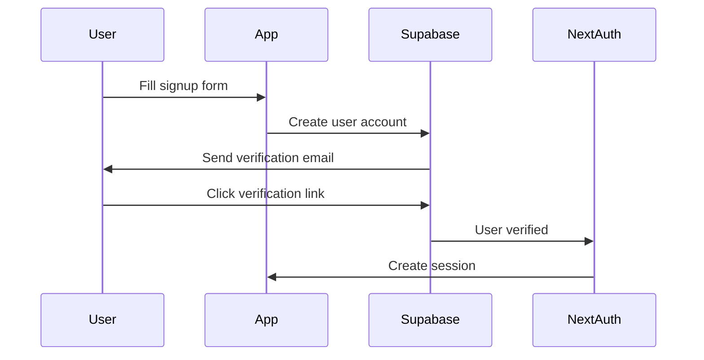
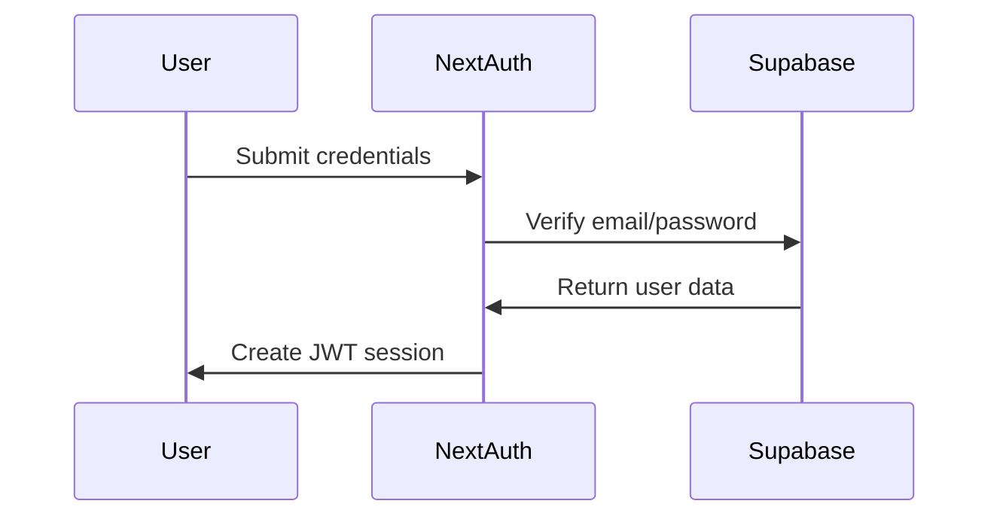
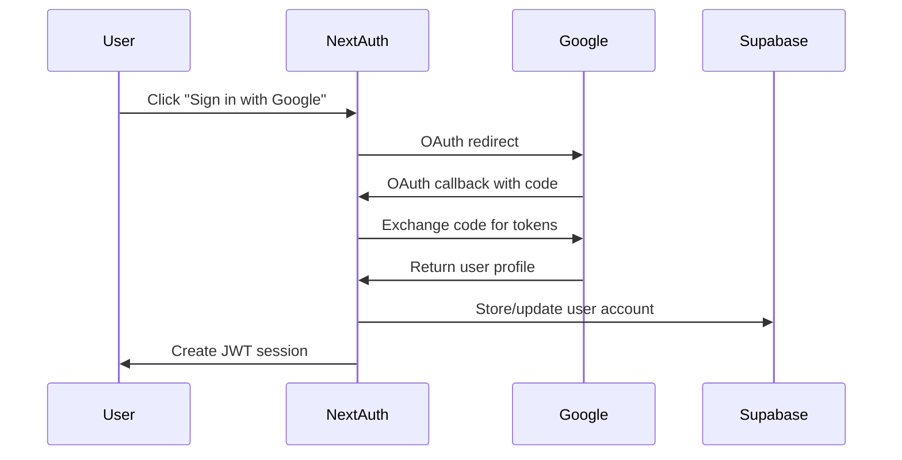

# Supabase Integration for NextAuth.js

This guide explains how the CU-BEMS IoT platform integrates Supabase with NextAuth.js for authentication and user management.

## Architecture Overview

The platform uses a hybrid approach:
- **NextAuth.js**: Handles authentication flows, session management, and OAuth providers
- **Supabase**: Provides the database backend and additional auth features
- **Custom Schema**: NextAuth tables are stored in a separate `next_auth` schema

## Database Schema Structure

### NextAuth Schema (`next_auth`)
Contains standard NextAuth.js tables:
- `users` - User profiles and basic information
- `accounts` - OAuth provider accounts linked to users
- `sessions` - Active user sessions
- `verification_tokens` - Email verification and password reset tokens

### Main Schema (`public`)
Contains application-specific tables:
- `subscriptions` - User subscription tiers and Stripe integration
- `user_activity` - Rate limiting and analytics tracking
- `sensor_readings` - Core IoT data (references `auth.users` for RLS)

## Setup Instructions

### 1. Environment Variables

Ensure these variables are set in your `.env.local`:

```bash
# Supabase Configuration
NEXT_PUBLIC_SUPABASE_URL=your_supabase_project_url
NEXT_PUBLIC_SUPABASE_ANON_KEY=your_supabase_anon_key
SUPABASE_SERVICE_ROLE_KEY=your_supabase_service_role_key

# NextAuth Configuration
NEXTAUTH_URL=http://localhost:3000
NEXTAUTH_SECRET=your_secure_secret_key
```

### 2. Database Migration

Run the database migration to create all necessary tables:

```bash
npm run db:migrate
```

This will execute:
- `001-core-schema.sql` - Core application tables
- `002-materialized-views.sql` - Performance optimization views
- `003-rls-policies.sql` - Row Level Security policies
- `004-nextauth-schema.sql` - NextAuth.js tables and policies

### 3. Verify Setup

Test the database connection:

```bash
npm run db:test
```

Check Supabase status:

```bash
npm run db:status
```

## Authentication Flow

### 1. User Registration (Sign Up)


### 2. Email/Password Sign In


### 3. Google OAuth Sign In


## Session Management

### JWT Strategy
- **Storage**: JWT tokens (stateless)
- **Duration**: 30 days
- **Security**: Signed with NEXTAUTH_SECRET
- **Contents**: User ID, email, subscription tier

### Session Extension
Sessions automatically extend on user activity. The middleware checks:
- Token validity
- User subscription status
- Route access permissions

## Row Level Security (RLS)

### NextAuth Tables
- **Service Role**: Full access for NextAuth operations
- **Authenticated Users**: Can read their own data only
- **Anonymous Users**: No access

### Application Tables
- **Subscriptions**: Users can only access their own subscription
- **User Activity**: Users can only see their own activity logs
- **Sensor Readings**: Filtered by subscription tier and permissions

## Integration Points

### 1. Subscription Management
When users sign up:
1. NextAuth creates user in `next_auth.users`
2. Trigger creates corresponding record in `public.subscriptions`
3. Default tier is set to 'free'
4. Stripe integration available for upgrades

### 2. Rate Limiting
Middleware tracks requests in `user_activity` table:
- API calls per hour/day
- Export requests
- Data access patterns
- Subscription tier enforcement

### 3. Data Access Control
Sensor data access is controlled by:
- User authentication status
- Subscription tier (free vs professional)
- Rate limiting quotas
- Time-based access windows

## Troubleshooting

### Common Issues

1. **"Schema next_auth does not exist"**
   ```bash
   npm run db:migrate
   ```

2. **"Permission denied for schema next_auth"**
   - Check SUPABASE_SERVICE_ROLE_KEY is correct
   - Verify service role has proper permissions

3. **"JWT secret not configured"**
   ```bash
   echo "NEXTAUTH_SECRET=$(openssl rand -base64 32)" >> .env.local
   ```

4. **Session not persisting**
   - Check NEXTAUTH_URL matches your domain
   - Verify cookies are enabled in browser
   - Check for HTTPS in production

### Debug Mode

Enable debug logging:
```bash
NEXTAUTH_DEBUG=1 npm run dev
```

## Security Considerations

### Production Checklist
- [ ] Rotate NEXTAUTH_SECRET
- [ ] Use HTTPS for NEXTAUTH_URL
- [ ] Enable Supabase CAPTCHA
- [ ] Configure email rate limiting
- [ ] Set up monitoring and alerting
- [ ] Review RLS policies
- [ ] Enable audit logging

### Best Practices
- Regular security updates
- Monitor for unusual activity
- Implement proper session timeout
- Use strong password policies
- Enable two-factor authentication (future enhancement)