# Epic 2: Story Prioritization and Execution Framework

**Document Type**: *story-prioritization
**Epic**: Bangkok Dataset Value Delivery
**Total Effort**: 32 story points across 5 stories
**Duration**: Week 2 (5 working days)
**Dependencies**: Epic 1 Complete (EXCEPTIONAL quality)

## Critical Path Analysis

### Primary Value Stream: Dashboard → Analytics → Professional Features

```mermaid
gantt
    title Epic 2: Bangkok Dataset Value Delivery
    dateFormat X
    axisFormat %d

    section Foundation
    Executive Dashboard    :crit, dashboard, 0, 2.5

    section Analytics Core
    Interactive Analytics  :analytics, after dashboard, 2

    section Professional Tier
    Data Export           :export, after analytics, 1.5
    Statistical UI        :stats, after analytics, 1.25
    Performance Monitor   :monitor, after stats, 0.75
```

### Story Execution Priority Matrix

| Priority | Story | Points | Dependencies | Critical Path | Business Impact |
|----------|--------|--------|--------------|---------------|-----------------|
| **P0** | 2.1: Executive Dashboard | 10 | Epic 1 Complete | YES | Core Value Demo |
| **P0** | 2.2: Interactive Analytics | 8 | Story 2.1 | YES | Engagement Driver |
| **P1** | 2.3: Data Export | 6 | Story 2.2 | YES | Revenue Differentiator |
| **P0** | 2.4: Statistical Confidence | 5 | Story 2.2 | NO | Differentiation Critical |
| **P1** | 2.5: Performance Monitoring | 3 | Story 2.4 | NO | Quality Assurance |

## Story-by-Story Execution Plan

### Story 2.1: Executive Dashboard with Statistical Validation
**Priority**: P0 (Product Core) | **Effort**: 10 points | **Duration**: 2.5 days

**Why First**: Foundation for all other Epic 2 features
- Establishes Bangkok dataset integration patterns
- Creates statistical display components for reuse
- Demonstrates core platform value immediately
- Required for user engagement measurement

**Dependencies Met**:
- ✅ NextAuth.js authentication (Epic 1.1)
- ✅ Subscription tier management (Epic 1.2)
- ✅ Bangkok dataset APIs operational
- ✅ R2+Supabase hybrid architecture proven

**Key Deliverables**:
- High-level building health overview (7-floor Bangkok analysis)
- Statistical confidence displays (p-values, confidence intervals)
- Energy efficiency metrics with cost projections
- Equipment performance summaries with failure predictions
- Regulatory-grade validation displays

**Success Criteria**:
- Dashboard loads in <3 seconds with complete insights
- All statistical validations verified against source data
- Mobile responsive design operational
- Professional tier features properly gated
- User testing validates insight comprehension >80%

**Handoff to Next Story**:
- Statistical display components available for reuse
- Bangkok dataset integration patterns established
- Performance optimization baseline set
- User engagement tracking operational

### Story 2.2: Interactive Time-Series Analytics
**Priority**: P0 (Engagement Critical) | **Effort**: 8 points | **Duration**: 2 days

**Why Second**: Builds on dashboard foundation, drives user engagement
- Uses established Bangkok dataset integration
- Leverages statistical components from Story 2.1
- Creates interactive patterns needed for export features
- Demonstrates platform depth beyond basic dashboards

**Dependencies Met**:
- ✅ Executive dashboard components (Story 2.1)
- ✅ Statistical display patterns established
- ✅ Bangkok dataset API performance validated
- ✅ Chart component architecture proven

**Key Deliverables**:
- Multi-sensor time-series visualization (144 Bangkok sensors)
- Interactive zoom and pan for detailed analysis (18-month period)
- Seasonal pattern identification and highlighting
- Anomaly detection with confidence scoring
- Comparative analysis between floors and equipment types

**Success Criteria**:
- Charts interact smoothly with 100K+ data points
- All zoom/pan operations respond within 100ms
- Professional export functionality integrated
- Statistical accuracy validated against source
- Memory usage optimized for extended sessions

**Handoff to Parallel Stories**:
- Interactive chart components ready for export
- Time-series data processing optimized
- User interaction patterns identified
- Performance metrics established for monitoring

### Story 2.3: Data Export for Professional Tier
**Priority**: P1 (Revenue Differentiator) | **Effort**: 6 points | **Duration**: 1.5 days

**Why Third**: Builds on analytics foundation, demonstrates Professional value
- Requires interactive analytics for export content
- Uses established statistical components
- Creates tangible Professional tier differentiation
- Enables workflow integration value proposition

**Dependencies Met**:
- ✅ Interactive analytics components (Story 2.2)
- ✅ Statistical confidence displays (Story 2.1)
- ✅ Professional tier gating (Epic 1.2)
- ✅ Stripe subscription validation operational

**Key Deliverables**:
- Multi-format export (PDF reports, CSV data, Excel workbooks)
- Executive report templates with statistical backing
- Custom date range selection (2018-2019 Bangkok period)
- Export job management for large datasets
- Professional tier authentication enforcement

**Success Criteria**:
- All export formats generate correctly with branding
- Professional tier gating enforced and tested
- Export completion rate >90% for all formats
- File delivery system reliable and tracked
- Usage tracking operational for business metrics

**Business Impact**:
- Differentiates Professional tier with tangible value
- Enables customer workflow integration
- Provides executive presentation materials
- Supports compliance and audit requirements
- Drives subscription conversion through demonstrated value

### Story 2.4: Statistical Confidence UI Components
**Priority**: P0 (Differentiation Critical) | **Effort**: 5 points | **Duration**: 1.25 days

**Why Fourth (Parallel with 2.3)**: Enhances existing components, regulatory critical
- Builds on statistical displays from Stories 2.1 and 2.2
- Can be developed in parallel with export functionality
- Critical for regulatory compliance positioning
- Enhances user trust and platform credibility

**Dependencies Met**:
- ✅ Statistical metrics display (Story 2.1)
- ✅ Interactive analytics components (Story 2.2)
- ✅ Bangkok dataset statistical validation
- ✅ User testing framework for comprehension validation

**Key Deliverables**:
- Confidence interval visualizations on all key metrics
- P-value displays with plain English explanations
- Statistical significance indicators and badges
- Visual uncertainty representations (error bars, ranges)
- Methodology documentation accessible from UI
- Audit trail showing statistical validation process

**Success Criteria**:
- All statistical concepts clearly communicated
- Confidence intervals accurately calculated and displayed
- User comprehension validated >80% through testing
- Accessibility standards met for visual elements
- Statistical accuracy verified by domain experts

**Platform Differentiation**:
- Regulatory-grade statistical validation
- Academic-level confidence in insights
- Professional presentation capability
- Audit trail for compliance documentation

### Story 2.5: Performance Monitoring and Analytics
**Priority**: P1 (Quality Assurance) | **Effort**: 3 points | **Duration**: 0.75 days

**Why Last**: Monitors all previous implementations, quality gate
- Requires all other components to be operational
- Provides insights for optimization
- Establishes baseline for Epic 3
- Ensures quality standards before Epic handoff

**Dependencies Met**:
- ✅ Executive dashboard operational (Story 2.1)
- ✅ Interactive analytics functional (Story 2.2)
- ✅ Export system operational (Story 2.3)
- ✅ Statistical displays comprehensive (Story 2.4)

**Key Deliverables**:
- Real-time performance monitoring for dashboard load times
- User engagement analytics and feature usage tracking
- Error tracking and automatic issue detection
- Performance benchmarking against <3s targets
- User behavior analysis for conversion optimization
- Conversion funnel analysis for Professional tier

**Success Criteria**:
- All performance metrics tracked accurately
- Alerting system functional for critical issues
- User behavior insights available for optimization
- Performance baselines established for Epic 3
- Reporting dashboard operational for stakeholders

## Parallel Development Strategy

### Days 1-2.5: Foundation Sprint
- **Primary Focus**: Story 2.1 Executive Dashboard
- **Team Allocation**: Full development focus on dashboard foundation
- **Deliverable**: Statistical dashboard with Bangkok insights

### Days 2.5-4: Analytics Sprint
- **Primary Focus**: Story 2.2 Interactive Analytics
- **Team Allocation**: Full development focus on interactive components
- **Deliverable**: Time-series analytics with user interaction

### Days 4-5: Professional Features Sprint
- **Parallel Development**:
  - **Track A**: Story 2.3 Data Export (1.5 days)
  - **Track B**: Story 2.4 Statistical UI (1.25 days)
  - **Track C**: Story 2.5 Performance Monitoring (0.75 days)
- **Coordination**: Shared statistical components, integrated testing

## Risk Mitigation in Execution Order

### Early Risk Resolution
1. **Bangkok Dataset Integration** (Story 2.1): Validate API performance and data accuracy
2. **Statistical Calculation** (Story 2.1): Verify confidence intervals and p-values early
3. **Performance Targets** (Story 2.1): Establish <3s load time baseline immediately

### Progressive Risk Reduction
- Story 2.1 validates all statistical foundations
- Story 2.2 proves chart performance with large datasets
- Story 2.3 demonstrates Professional tier value
- Story 2.4 ensures regulatory compliance readiness
- Story 2.5 provides monitoring for sustained quality

### Dependency Risk Management
- Each story builds incrementally on previous success
- No story requires functionality from later stories
- Parallel development minimizes blocking dependencies
- Clear handoff criteria prevent integration issues

## Quality Gates Between Stories

### Story 2.1 → 2.2 Gate
- [ ] Dashboard loads <3s consistently
- [ ] Statistical accuracy validated against source
- [ ] Bangkok dataset API performance confirmed
- [ ] Statistical display components reusable
- [ ] Mobile responsiveness operational

### Story 2.2 → 2.3/2.4 Gate
- [ ] Interactive charts perform <100ms response
- [ ] Large dataset handling optimized
- [ ] Chart export functionality ready
- [ ] User engagement tracking operational
- [ ] Memory management validated

### Stories 2.3/2.4 → 2.5 Gate
- [ ] Export system >90% completion rate
- [ ] Professional tier differentiation clear
- [ ] Statistical UI comprehension >80%
- [ ] All components integration-tested
- [ ] Performance baselines established

## Success Metrics by Story

### Cumulative Value Delivery

**After Story 2.1** (Day 2.5):
- Core platform value demonstrated
- Statistical credibility established
- Bangkok insights accessible
- Performance baseline set

**After Story 2.2** (Day 4.5):
- Interactive analytics operational
- User engagement measurable
- Platform depth demonstrated
- Professional value visible

**After Stories 2.3/2.4** (Day 5):
- Professional tier differentiated
- Revenue features operational
- Regulatory compliance ready
- Export adoption trackable

**After Story 2.5** (Day 5):
- Quality monitoring operational
- Epic 2 success measurable
- Epic 3 foundation prepared
- Business metrics available

## Epic 3 Handoff Readiness

### Foundation Prepared
- Statistical analytics platform operational and validated
- Professional tier value demonstrated and measured
- User engagement patterns identified and tracked
- Performance monitoring established with baselines
- Bangkok dataset integration proven and optimized

### Business Metrics Available
- Dashboard adoption rates and engagement patterns
- Professional tier conversion rates from analytics usage
- Export feature adoption and business impact
- User comprehension rates for statistical insights
- Performance metrics for optimization opportunities

### Technical Architecture Ready
- Scalable analytics components for advanced features
- Statistical validation framework for new insights
- Professional tier feature gating patterns established
- Monitoring and alerting infrastructure operational
- API performance optimized for additional features

**EXECUTION RECOMMENDATION**: Follow this prioritization exactly. The critical path ensures maximum value delivery with minimum risk, while parallel development in the final sprint optimizes team velocity and Epic completion timing.