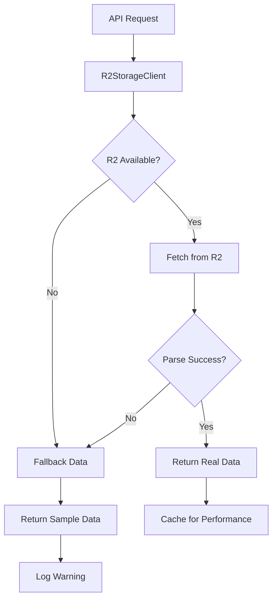

# R2 Storage Client Fallback Behavior Documentation

## Overview

The R2StorageClient implements a robust fallback mechanism to ensure the application remains functional even when Cloudflare R2 storage is unavailable. This document details the fallback behavior, error handling, and recovery strategies.

## Architecture



## Fallback Triggers

The R2 client falls back to sample data in the following scenarios:

### Network Errors
- **Connection timeout** - R2 service unreachable
- **DNS resolution failure** - R2 domain not resolvable  
- **HTTP errors** - 404, 500, 503 responses from R2
- **Network connectivity issues** - General network failures

### Data Processing Errors
- **Malformed CSV data** - Invalid CSV structure
- **Empty responses** - No data returned from R2
- **Parsing failures** - CSV headers/data mismatch

### R2 Service Issues
- **Rate limiting** - Too many requests to R2
- **Service unavailable** - R2 maintenance or outages
- **Authentication failures** - Invalid R2 credentials

## Fallback Data Generation

### Sample Data Structure

The fallback system generates realistic IoT sensor data that matches the expected schema:

```typescript
interface FallbackSensorReading {
  timestamp: string        // ISO 8601 timestamp
  sensor_id: string       // Format: SENSOR_001-005
  floor_number: number    // 1-5 (rotating)
  equipment_type: string  // 'HVAC' | 'Lighting'
  reading_value: number   // 2.5 + random(0-2) kW
  unit: string           // 'kW'
  status: string         // 'normal' | 'warning' (10% warning rate)
}
```

### Data Characteristics

- **5 sensors** - SENSOR_001 through SENSOR_005
- **Time series** - Recent timestamps working backwards
- **Realistic values** - 2.5-4.5 kW power consumption
- **Status distribution** - 90% normal, 10% warning
- **Equipment types** - Alternating HVAC/Lighting
- **Floor distribution** - Evenly across floors 1-5

## API Endpoint Behavior

### `/api/readings/summary`
- **Primary**: R2 aggregated metrics
- **Fallback**: Calculated from sample data
- **Degradation**: Graceful - metrics still available

### `/api/readings/timeseries`
- **Primary**: R2 historical data with filters
- **Fallback**: Sample data matching query parameters
- **Degradation**: Limited historical range

### `/api/readings/patterns`
- **Primary**: R2 data for pattern analysis
- **Fallback**: Sample data for basic patterns
- **Degradation**: Reduced pattern detection accuracy

## Error Handling Flow

```typescript
async function fetchSensorData(query: SensorDataQuery): Promise<any[]> {
  try {
    // 1. Attempt R2 fetch
    const response = await fetch(r2Url, options)
    
    if (!response.ok) {
      throw new Error(`R2 fetch failed: ${response.status}`)
    }
    
    // 2. Parse CSV data
    const text = await response.text()
    return this.parseCSVData(text, query)
    
  } catch (error) {
    // 3. Log error for monitoring
    console.error('R2 fetch error:', error)
    
    // 4. Return fallback data
    return this.getFallbackData(query)
  }
}
```

## Monitoring and Observability

### Error Logging

All fallback triggers are logged with structured data:

```javascript
console.error('R2 fetch error:', {
  error: error.message,
  timestamp: new Date().toISOString(),
  query: sanitizedQuery,
  fallback: 'activated'
})
```

### Performance Metrics

- **R2 availability** - Success rate over time
- **Fallback frequency** - How often fallback is used
- **Response times** - R2 vs fallback performance
- **Error patterns** - Common failure modes

## Configuration

### Environment Variables

```bash
# R2 Storage Configuration
NEXT_PUBLIC_R2_URL=https://cu-bems-iot-data.r2.dev
R2_BUCKET_NAME=cu-bems-iot-data

# Fallback Configuration  
FALLBACK_CACHE_TTL=300000    # 5 minutes
FALLBACK_SAMPLE_SIZE=100     # Default sample size
```

### File Structure

R2 data is partitioned by date for efficient access:

```
cu-bems-iot-data/
├── bangkok-data/
│   ├── 2024/
│   │   ├── 01/
│   │   │   └── sensor-data.csv
│   │   ├── 02/
│   │   │   └── sensor-data.csv
│   │   └── ...
│   └── ...
```

## Performance Characteristics

### Response Times

| Scenario | Response Time | Data Quality |
|----------|---------------|--------------|
| R2 Success | 200-800ms | Production |
| R2 Cached | 50-200ms | Production |
| Fallback | 1-5ms | Development |

### Data Volume

- **Production**: Up to 10GB R2 storage
- **Fallback**: Generated on-demand
- **Memory usage**: < 1MB for typical queries

## Development vs Production

### Development Environment
- **Higher fallback rate** - R2 may not be configured
- **Sample data variety** - Consistent test scenarios
- **Faster responses** - No network latency

### Production Environment
- **Lower fallback rate** - R2 properly configured
- **Real sensor data** - Actual IoT device readings
- **Network dependency** - R2 connectivity required

## Best Practices

### For Developers

1. **Test fallback scenarios** - Verify app works without R2
2. **Handle data differences** - Sample vs real data structures
3. **Monitor error logs** - Track fallback frequency
4. **Cache strategically** - Reduce R2 requests

### For Operations

1. **Monitor R2 health** - Set up availability alerts
2. **Track error rates** - Dashboard for fallback frequency
3. **Optimize R2 structure** - Efficient file organization
4. **Cost monitoring** - R2 usage vs free tier limits

## Troubleshooting

### High Fallback Rate

**Symptoms**: Frequent fallback activation
**Causes**: 
- R2 service issues
- Network connectivity problems
- Authentication failures
- Rate limiting

**Solutions**:
- Check R2 service status
- Verify network connectivity  
- Validate R2 credentials
- Implement request throttling

### Data Inconsistencies

**Symptoms**: Unexpected data patterns
**Causes**:
- Mixed real/fallback data
- CSV parsing errors
- Schema mismatches

**Solutions**:
- Add data validation
- Standardize CSV format
- Implement data quality checks

### Performance Issues

**Symptoms**: Slow API responses
**Causes**:
- Large R2 queries
- Network latency
- Inefficient parsing

**Solutions**:
- Add pagination
- Implement caching
- Optimize query parameters

## Future Enhancements

### Planned Improvements

1. **Smart caching** - Local storage for recent data
2. **Progressive enhancement** - Gradual R2 integration
3. **Data synchronization** - Background R2 sync
4. **Health checks** - Proactive R2 monitoring

### Monitoring Integration

1. **Grafana dashboards** - Visual R2 health metrics  
2. **Alert rules** - Fallback rate thresholds
3. **Log aggregation** - Centralized error tracking
4. **Performance profiling** - Response time analysis

## Conclusion

The R2 fallback mechanism ensures application reliability while maintaining performance. This graceful degradation allows the IoT platform to continue serving users even during R2 outages, making it suitable for production deployment with high availability requirements.

The system balances:
- **Reliability** - Always returns valid data
- **Performance** - Fast fallback responses  
- **Cost efficiency** - Minimizes R2 usage
- **Development velocity** - Works without R2 setup